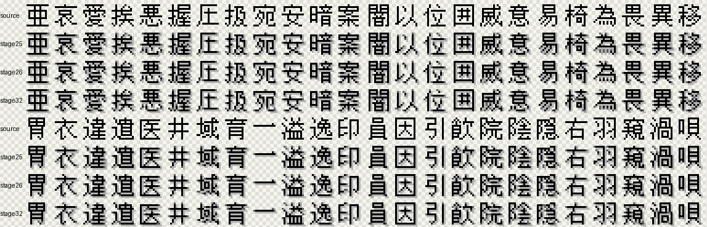

# Font Machine Learn

把开源点阵字体转换成 Nintendo DS 风格的 `15x15` 四级像素字体：

```text
1bpp 点阵源字形 -> 0/1/2/3 分层 RGBA 位图字体
```

层含义：

- `0`: 透明背景
- `1`: 右下阴影
- `2`: 灰色边缘 / 抗锯齿过渡
- `3`: 主笔画

当前默认源字体是文泉驿点阵宋体 13px。项目会尽量保留源字形，只学习目标字模的分层风格。



图中行顺序：`sharp13`、`sharp14`、`song12`、`source/song13`、`stage25`、`stage26`、`stage32`。公开图不包含原始目标 NFTR 字模行。

## 下载字体

Release 里提供两套完整字体包：

- `font-machine-learn-stage32-song13-fullcmap.zip`
- `font-machine-learn-stage32-song12-fullcmap.zip`

每个 zip 内包含：

- `*.fnt`: AngelCode BMFont 文本格式，含 Unicode 映射和 advance
- `*.png`: RGBA 图集，保留透明、阴影、灰边、主笔四级效果
- `*.json`: 构建参数和逐字记录
- `glyphs/`: 单字 PNG
- `COPYRIGHT.md`
- `LICENSES/GPL-2.0.txt`

推荐优先试 `song13`。`song12` 更小、更松，但观感会更细。

## 使用 Release 字体

这不是 TTF/OTF 字体，而是位图字体资源包。用法通常是：

1. 读取 `.fnt` 里的 `char id/x/y/width/height/xadvance`
2. 从同名 `.png` 图集中裁出对应 `15x15` RGBA glyph
3. 按 `xadvance` 排版
4. 原样保留 RGBA 像素，不要重新抗锯齿或缩放滤波

渲染时请使用 nearest-neighbor。BDF/PCF 这类 1bpp 格式不适合本项目，因为会丢掉阴影和灰边。

## 本地开发

```powershell
python -m venv .venv
.\.venv\Scripts\Activate.ps1
python -m pip install -r requirements.txt
python -m pip install -r requirements-ml.txt
python scripts/check_env.py
.\.venv\Scripts\python.exe -m unittest discover
```

CUDA PyTorch 安装命令：

```powershell
.\.venv\Scripts\python.exe -m pip install --force-reinstall torch --index-url https://download.pytorch.org/whl/cu130
```

## 重新生成 Release 包

Song13:

```powershell
.\.venv\Scripts\python.exe scripts\build_release_bmfont.py --out-dir release/font-machine-learn-stage32-song13-bmfont --package-name font-machine-learn-stage32-song13
```

Song12:

```powershell
.\.venv\Scripts\python.exe scripts\build_release_bmfont.py --font fonts/WenQuanYi.Bitmap.Song.12px.ttf --out-dir release/font-machine-learn-stage32-song12-bmfont --package-name font-machine-learn-stage32-song12
```

脚本默认枚举所选文泉驿字体自己的 cmap，不使用游戏专用的 `ds_nftr/a.txt`。这样别人下载 release 后不用再生成字库。

## 重新生成 README 对比图

```powershell
.\.venv\Scripts\python.exe scripts\build_public_comparison_contact.py
```

## 本地目标 NFTR

`a.NFTR` 不随公开仓库分发。若要复现实验或重新训练，请把自己有权使用的解压后 2bpp NFTR 放到仓库根目录：

```powershell
.\.venv\Scripts\python.exe scripts\extract_target_glyphs.py a.NFTR
```

生成的目标字模 PNG/JSON 和 NFTR 文件默认被 `.gitignore` 忽略。

## 关键阶段

| stage | 说明 |
|---|---|
| 25 | source-locked 规则基线，CJK visual `0.6409` |
| 26 | source-locked MLP 分层，CJK visual `0.6339` |
| 30 | target `>=2` tiny torch CNN，CUDA CJK visual `0.9790` |
| 31 | Song13 tiny torch CNN transfer，CJK visual `0.6332` |
| 32 | 公开对比图和 release 包 |

## 授权

- 文泉驿字体按 GPL 授权；见 `COPYRIGHT.md` 和 `LICENSES/GPL-2.0.txt`
- 本项目发布的 BMFont 包由文泉驿字体生成，按 GPL-2.0-only 发布
- 本仓库不分发 `a.NFTR`、游戏 ROM、存档或生成 NFTR
